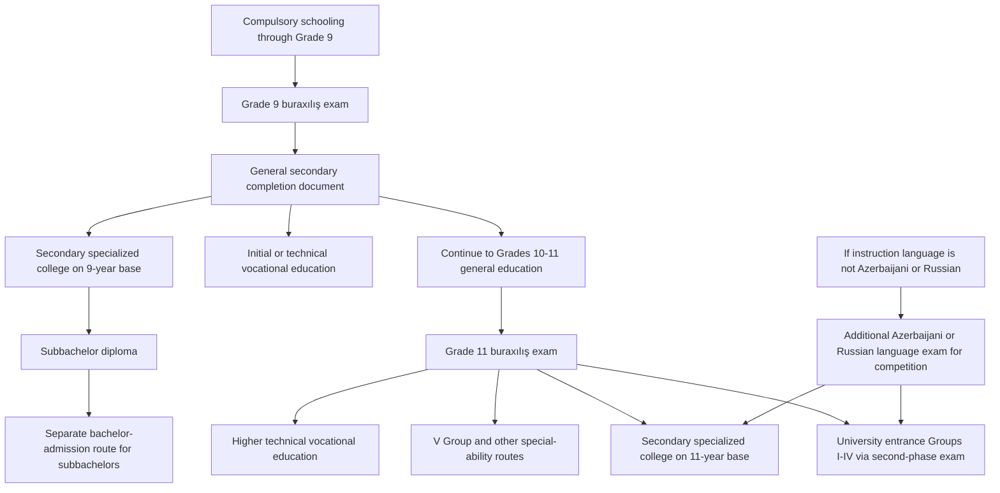

# Existing Education and Exam System in Azerbaijan

## Executive summary

Azerbaijan’s formal schooling structure is legally organized into three general-education levels: primary, general secondary, and full secondary. General secondary education is compulsory. Completion of the general secondary level produces a state educational document that serves as the basis for continuation into full secondary, vocational, or secondary specialized education; completion of the full secondary level ends with state final attestation and an attestat that qualifies the holder for further postsecondary study. The core public exam administrator is the State Examination Center, or DİM, while the Ministry of Science and Education remains the principal policy authority. citeturn12view0turn11view2turn10view0turn34view1

At the operational level, the current Azerbaijani exam system is highly centralized, multi-stage, and year-specific. For Grade 9, DİM’s current scoring materials for the 2025–2026 cycle show a single-session, 81-task exit examination worth up to 300 points across language of instruction, mathematics, and a foreign language. For Grade 11, the school-leaving exam for current-year graduates is simultaneously the **first phase** of university admission for Groups I–IV, again worth up to 300 points; a second subject-group exam worth up to 400 points then determines final university competition standing on a 700-point scale. citeturn16view0turn16view1turn41view0turn17view0turn18view0

The system is also linguistically differentiated. Azerbaijani- and Russian-medium schools are the main standardized tracks in DİM’s public exam materials, but Georgian-medium schools and English-medium schools are explicitly recognized in current schedules and results notices. Students educated in a non-Azerbaijani instructional language face an additional state-language compliance layer: for entry into Azerbaijani higher or secondary specialized education, they must satisfy the separate Azerbaijan-language-as-state-language requirement, with 50 points functioning as the “acceptable” threshold in the official DİM FAQ. citeturn13view0turn39view2turn39view0turn42view0

For LLM benchmarking, Azerbaijan is unusually useful because it combines several evaluation regimes in one national pipeline: closed multiple-choice items, coded open responses, marker-scored written responses, essays, listening-based foreign-language tasks, and weighted multi-subject competition algorithms. At the same time, the system is vulnerable to “document drift”: the standing attestation regulation available on the Ministry site still reflects older procedural models for some exams, whereas DİM’s session-specific operational documents define the actual current exam format. Any benchmark claiming to represent “the Azerbaijani exam system” should therefore be year-stamped and source-layered. citeturn34view1turn35view0turn16view0turn17view0turn41view0

## System architecture and credential logic

Under the Education Law, Azerbaijan’s education system distinguishes general secondary education from full secondary education. General secondary education is compulsory, and the state document issued at that level is the legal basis for progression to the next level. Full secondary education is the final stage of general schooling and ends with final state attestation; the resulting document is the credential normally used for entry to higher education. citeturn11view2turn12view0

In administrative practice, DİM conducts the centralized final attestation examinations. The 2016 Cabinet rules available on the Ministry website state that final attestation is carried out by DİM, that the process is free of charge for learners, that results are written into an electronic education document, and that the electronic record is the basis for issuance of the state-format credential. Those same rules also state that students with ungraded subjects, or—at full secondary level—students with annual grade **2** in any subject, are not admitted to final attestation and instead receive only a certificate of study rather than the completion credential. citeturn34view1turn40view6

A notable analytical complication is that the standing rule text retrievable from 2016 still describes an older two-stage Grade 9 model and a 5-point conversion table for Grade 11, while DİM’s current 2024–2026 operational materials describe a different, more admissions-integrated architecture: Grade 9 is now operationalized as a one-session 300-point exam, and Grade 11 first-phase scoring is explicitly tied to university admissions. The safest reading is that the legal framework establishes who is attested and how credentials are issued, while session-year DİM documents establish the actual exam design used in a given cycle. citeturn34view1turn35view0turn16view0turn17view0turn41view0

The student pathway can therefore be represented as follows:

This pathway synthesizes the Education Law, DİM’s bachelor-admission rules, the vocational-admissions portal, and DİM’s FAQ materials on language-track and subbachelor alternatives. citeturn12view0turn41view0turn41view2turn42view0turn23view1

### Comparative overview of the main public assessments

| Assessment | Typical stage | Main subjects | Current scoring scale | Primary function |
|---|---|---|---|---|
| Grade 9 buraxılış exam | End of general secondary | Instruction language, mathematics, foreign language | Up to 300 total | Final attestation for general secondary; access to 9-year colleges and onward pathways |
| Grade 11 buraxılış exam | End of full secondary | Azerbaijani or Russian, mathematics, foreign language | Up to 300 total | Final attestation for full secondary; also first phase of HE admission for current-year graduates |
| Azerbaijan language as state-language exam | Mainly for non-Azerbaijani instructional tracks | Azerbaijani language | Acceptable / unacceptable logic, with 50 as the relevant DİM threshold in FAQ practice | Required for admission competition when the instructional language is not Azerbaijani |
| University entrance, second phase, Groups I–IV | After Grade 11 or for previous-year graduates | Group-specific triads | Up to 400 total | Specialty-group competition for bachelor entry |
| V Group special-ability route | After Grade 11 | No fixed second-phase triad; uses first-phase/buraxılış result plus ability testing | Mixed: score and/or pass/fail, depending on specialty | Admission to special-ability fields |
| Vocational admissions | After Grade 9 or Grade 11 | Grade- or exam-based, depending on level | Varies by vocational tier | Entry to initial, technical, or higher technical vocational programs |

The table reflects the current DİM bachelor and ability pages, DİM’s 9th- and 11th-grade scoring materials, and the Vocational Education Agency admissions page. citeturn16view0turn16view1turn41view0turn41view1turn41view2turn42view0

## Ninth-grade final assessment

The Grade 9 exam is the endpoint of **general secondary education**, which the Education Law treats as compulsory and as the legal bridge to later educational stages. In current practice, DİM administers this exam as a centralized “buraxılış imtahanı,” and its result is used both for final attestation and for competition to secondary specialized institutions on a 9-year base. DİM’s FAQ further states that Grade 9 buraxılış results remain valid for **two years** for college competition, although candidates may also choose to sit again. citeturn12view0turn26view0turn19search4

For the 2025–2026 cycle, DİM’s published scoring sheet shows a **single-session** Grade 9 exam lasting **3 hours** and containing **81 tasks** in total. Each of the three tested subjects carries a maximum of **100 relative points**, for a total of **300**. The tested subjects are the language of instruction, mathematics, and a foreign language; the foreign-language options explicitly listed are English, German, French, Russian, Arabic, and Persian. citeturn16view0turn16view1

The current subject formats are notably mixed. In the language-of-instruction paper, DİM specifies 30 tasks, combining 10 closed grammar items with two reading texts whose associated tasks include both closed items and written open responses. Mathematics contains 25 tasks, mixing closed items, coded open responses, and fully written solutions. Foreign language contains 26 tasks and is the most multimodal of the three: listening items, text-based reading items, grammar/lexis items, and one picture-based essay task. Wrong answers do **not** reduce the score on this Grade 9 exam. citeturn16view0turn16view1

### Grade 9 exam design in the current DİM operational model

| Subject | Structure in current DİM scoring sheet | Maximum |
|---|---|---|
| Language of instruction | 10 closed grammar items; 2 reading texts with 20 linked tasks, including written open responses | 100 |
| Mathematics | 15 closed items; 6 coded open items; 4 fully written open items | 100 |
| Foreign language | 1 listening text with 4 tasks; 8 text-based tasks; 13 grammar/lexis tasks; 1 picture-based essay | 100 |
| Total | 81 tasks; 3 hours | 300 |

This table is taken directly from DİM’s current Grade 9 scoring document. citeturn16view0turn16view1

In linguistic terms, DİM currently publishes Grade 9 programs separately for Azerbaijani and Russian sections, and it separately publishes the Azerbaijan-language-as-state-language exam for Russian-track students. Current DİM notices also state that students in Georgian-medium schools and other “other-language” schools are covered by special arrangements, and older attestation rules specify that non-Azerbaijani/non-Russian schools may sit reduced subject sets and then take an additional Azerbaijani or Russian exam if they want to compete for further education in that language. citeturn13view0turn39view2turn35view0turn35view1

On **pass thresholds**, the current DİM Grade 9 scoring document retrieved for 2025–2026 specifies score construction but does **not** identify a single universal national raw “pass mark” for the 300-point total. The more stable rules concern attestation eligibility and credential issuance rather than a single 300-point cutoff: students who are not admitted to final attestation or do not complete it do not receive the state completion credential, while excused absences are handled through special or later sittings. Because the current legal amendment trail was not fully recoverable from line-level sources, this is one area where it is better to record “not specified in current retrieved DİM operational materials” than to infer a pass score. citeturn16view0turn16view1turn34view1turn39view1

The consequences of Grade 9 performance are substantial. Legally, completion of the general secondary level yields the state document that grounds progression to the next level. Practically, a Grade 9 completer may continue into Grades 10–11, enter vocational education, or compete for secondary specialized education on a 9-year base. The Vocational Education Agency separately states that vocational admissions at the lower tiers are based on the averages of the relevant grades recorded on the school document rather than on a distinct centralized vocational entrance test. citeturn12view0turn41view2

## Eleventh-grade school leaving and secondary completion

At Grade 11, Azerbaijan’s exam system becomes more tightly coupled to tertiary admissions. DİM’s bachelor page states that for current-year graduates the first phase of the university entrance exam is the Grade 11 buraxılış exam itself, and that these first-phase results remain valid for **two years**. The current Grade 11 buraxılış result is therefore simultaneously a school-leaving assessment and a university-admissions asset. citeturn41view0

The current operational Grade 11 design presents **85 tasks** over **3 hours**. DİM’s scoring sheet allocates 30 tasks to Azerbaijani or Russian language, 25 to mathematics, and 30 to foreign language, again with each subject scaled to a maximum of **100**, for **300** total. Compared with Grade 9, the Grade 11 papers demand more written output: language includes more written-response items; mathematics includes a larger number of fully written solutions; and foreign language combines listening, reading, closed items, and written open responses. Wrong answers still do **not** reduce first-phase scores. citeturn17view0turn18view0turn41view0

The old 2016 attestation regulation remains important because it still describes credential issuance. It states that full secondary students who have ungraded subjects or annual grade **2** are not admitted to final attestation; those not admitted, or those who do not participate, receive only a study certificate rather than the completion credential. The same regulation also says that final attestation results are entered electronically and then used as the basis for the state-format education document. citeturn34view1turn40view6

The law and Ministry document rules clarify the credential side. Full secondary education is the final level of general education and ends with final state attestation and an attestat. The Ministry’s document-issuance rules specify that full secondary graduates may receive an ordinary attestat, a distinction attestat, or a special-pattern attestat for medal recipients, and that the final document records annual and exam-based attestation results. citeturn12view0turn10view0

### Grade 11 subjects, scoring, and state-language compliance

| Element | Current operational rule |
|---|---|
| Main Grade 11 buraxılış subjects for Azerbaijani-medium schools | Azerbaijani language, mathematics, foreign language |
| Main Grade 11 buraxılış subjects for Russian-medium schools | Russian language, mathematics, foreign language |
| Maximum score | 300 total, 100 per subject |
| Current-year role in HE admissions | Counts as the first phase of admission for Groups I–IV |
| Separate state-language requirement for non-Azerbaijani instructional tracks | Azerbaijan language as state language; 50 and above counts as “acceptable” in DİM FAQ practice |
| Consequence of failing that state-language requirement | Candidate is not admitted to higher- or secondary-specialized-admission competition until obtaining “acceptable” status |

The table synthesizes DİM’s bachelor page, DİM’s FAQ, and DİM’s 2026 state-language notices. citeturn41view0turn42view0turn39view1turn39view2

The state-language layer is especially important for Russian-medium and other non-Azerbaijani tracks. DİM’s FAQ states that current-year graduates from non-Azerbaijani instructional schools are treated as having passed the Azerbaijan-language-as-state-language requirement when they score at least **50**; those below **50** are treated as **qeyri-məqbul** and cannot participate in the higher- or secondary-specialized-admission competition until they pass in a later sitting. DİM’s 2026 notice set the second registration window for this exam from **May 25 to June 2**, with the exam on **June 21**. citeturn42view0turn39view1

There is also a current-year difference for English-medium and other non-Azerbaijani/non-Russian schools. DİM’s 2026 Grade 11 results notice explicitly states that graduates of schools teaching in a different language sit only **two subjects**—mathematics and foreign language—and can therefore score at most **200** points on the main buraxılış exam. DİM names an ADA School graduate as the top scorer under this 200-point regime. The older attestation regulation likewise states that non-Azerbaijani/non-Russian schools use reduced subject sets and require an additional Azerbaijani or Russian exam for subsequent competition in those languages. citeturn39view0turn36view0

For retakes and absences, the official position is layered. DİM’s 2026 notices state that students whose final attestation is not completed will be given a further exam opportunity in **September**. The standing attestation rules also provide individual makeup handling for excused absences and allow complaints through an Appeal Commission. This means that “retake” is not one single mechanism: there are separate pathways for excused absence, state-language second attempt, prior-year re-entry, and in some cases eksternat. citeturn39view1turn36view0

## University entrance examinations

For mainstream bachelor entry, DİM’s bachelor page defines a **two-phase** examination system for Groups I–IV. Phase one is worth **300** points and, for current-year graduates, is simply the Grade 11 buraxılış result. Phase two is worth **400** points. The final competition total is therefore **700** points. Phase-one results are valid for two years, while phase-two results are valid only for the current admission year. DİM also allows candidates to take the second-phase exam in two sessions, broadly corresponding to spring and summer attempts. citeturn41view0turn17view3turn18view0

The phase-two design is more uniform across groups than many foreign systems. DİM states that candidates receive **30 items per subject**, or **90 items total**, across the three second-phase subjects. For each subject, **22 items are closed** and **8 are open**. The 8 open items split into 5 coded open responses and 3 marker-scored written items. DİM further states that the written items are situation-based in mathematics and natural sciences, text-based in language and literature, and source-based in history. This is a particularly important feature for benchmarking because it makes the second phase partly retrieval- and reasoning-intensive rather than simple recognition-only testing. citeturn17view3turn18view0turn32search9

Unlike the first phase, phase two uses **negative marking** on closed items. DİM’s scoring rule says the closed-item relative score is computed using correct answers minus one quarter of wrong answers, with a zero floor if the result is negative. Open items have no such penalty. In analytical terms, this creates a different response strategy from Grade 9 and Grade 11 buraxılış exams, where wrong answers do not reduce the result. citeturn18view0turn17view3

### Subject groups and weights for Groups I–V

| Group | Subjects used for competition | Relative weights |
|---|---|---|
| I Group, RK subtrack | Mathematics, physics, chemistry | 1.5, 1.5, 1 |
| I Group, Rİ subtrack | Mathematics, physics, informatics | 1.5, 1.5, 1 |
| II Group | Mathematics, geography, history | 1.5, 1.5, 1 |
| III Group, DT subtrack | Azerbaijani or Russian language, history, literature | 1.5, 1.5, 1 |
| III Group, TC subtrack | Azerbaijani or Russian language, geography, history | 1.5, 1.5, 1 |
| IV Group | Biology, chemistry, physics | 1.5, 1.5, 1 |
| V Group | No fixed second-phase subject triad; uses first-phase/buraxılış result plus ability exam | Not applicable in the same form |

This grouping and weighting structure is stated on DİM’s bachelor page and in the published scoring rules. citeturn41view0turn18view0

The V Group is structurally different. DİM’s ability page states that current-year Grade 11 graduates do **not** sit an additional general admission test for V Group; they compete using the buraxılış result plus the relevant ability examination. Previous-year graduates and those who completed secondary school abroad instead sit a buraxılış-format admission test and then compete on that basis. DİM also states that a candidate may compete simultaneously in V Group and in one or two of Groups I–IV in the same year. citeturn41view1

V Group is not the only part of the system with special requirements. DİM’s ability page specifies that **memarlıq** is formally connected to Group I, **jurnalistika** to Group III, and **islamşünaslıq** to Group III, with additional ability testing or interview requirements layered on top of ordinary test competition. This is another reason that purely “group-number” descriptions of Azerbaijani admissions are incomplete unless they also note special overlays. citeturn41view1

### Minimums, thresholds, and what was and was not specified for 2026

As of the date of this report, the retrieved **2026** DİM materials include the annual calendar and admission announcement, but the full specialty-choice booklet containing the final annual competition conditions for every program was not yet retrieved from an official 2026 source. The most recent full official set recovered in the research was the **2025** competition-conditions PDF. It should therefore be treated as the most recent fully published baseline, not as a confirmed 2026 rule. citeturn22search2turn43search7turn23view0

The 2025 official baseline was as follows. For most programs in Groups I–IV, DİM required at least **200 total points** and at least **100 phase-two points**. There were lower-threshold windows—typically **150 total** and **50 phase-two**—for named lower-demand specialties, and there were higher special requirements for certain programs, such as Group I mathematics, physics, and computer science at **250 total** and **100 phase-two**. Many English-medium state-university programs also required at least **40 relative points in English** from phase one, with explicit institutional exceptions. Because these thresholds are published annually, they should not be hard-coded into a benchmark without a year tag. citeturn23view0turn24view0turn24view1turn24view2turn40view9

DİM’s FAQ also makes three important threshold clarifications. First, there is a conceptual distinction between **müsabiqə şərti** and **keçid balı**: the former is the minimum condition for being admitted to the competition, while the latter is the realized last-admitted score for a particular specialty. Second, current-year graduates may still sit phase two even if they did poorly on phase one; phase-one weakness does not itself bar them from the second-phase test. Third, previous-year graduates who retake phase one may choose which first-phase result to use in the competition. citeturn19search7turn42view0turn26view0

### Registration, dates, retakes, and accommodations

DİM’s 2026 calendar and bachelor notices establish a fairly regular annual sequence. Initial higher-education application registration for 2026 ran from **February 18 to March 5**. The first-phase exam for previous-year graduates was held on **April 19**, which was also the date for the extra foreign-language exam for current-year graduates who wished to compete using a foreign language different from the one taken in the buraxılış exam. Registration for the first attempt at phase two ran from **April 7 to May 1**. The first phase-two sittings were **May 24** for Groups II–III and **June 7** for Groups I–IV, with Geography extras for III DT/TC dual-track candidates on **June 7**. DİM’s updated calendar then listed the second attempts as **July 5** for Groups II–III and **July 12** for Groups I–IV, with the second Geography extra also on **July 12**. citeturn43search8turn3view3turn43search0turn43search1

For school-leaving exams, current-year Grade 11 buraxılış exams were held by zones on **March 9** and **March 15**, while Grade 9 buraxılış exams were held on **April 5**, **April 12**, and **April 26**. The separate Azerbaijan-language-as-state-language exam was held on **May 3**, with a second sitting on **June 21** for eligible candidates. DİM also notes that students do **not** self-register for school-leaving exams: schools upload the data to the **Şagird-məzun** system, and learners later print their admit cards. citeturn40view4turn25search6turn25search9turn39view1turn26view0

For ordinary university applications, candidates use a DİM **personal cabinet** and an electronic application form. DİM’s FAQ states that where the agency already has sufficient data, the applicant confirms the application personally; where the information is insufficient, the applicant must present documents to a **Sənəd Qəbulu Komissiyası**. The same FAQ states that candidate fees are paid through the personal-cabinet balance, and that certain categories—including some disabled applicants, martyr-family members, and displaced persons—are exempt. citeturn26view0

Accommodations are explicitly available. DİM’s FAQ says that candidates with disabilities can obtain special exam conditions if they submit the relevant documents at least **14 days before** the exam. A DİM exam report then illustrates what this means operationally: special rooms, individual invigilators for candidates with severe visual impairment, and access arrangements for mobility-limited candidates. In addition, health-based exemption from school-leaving exams is recognized in the attestation rules, although exempted students are not eligible for distinction credentials. citeturn26view0turn25search4turn29view1turn34view1

### A concise 2026 timeline

| Window or date | Event |
|---|---|
| February 18 – March 5 | Initial HE application registration |
| March 9 and March 15 | Grade 11 buraxılış exams by zone |
| April 5, April 12, April 26 | Grade 9 buraxılış exams by zone |
| April 7 – May 1 | Registration for phase two, first attempt |
| April 19 | Phase one for previous-year graduates; extra foreign-language exam |
| May 3 | Azerbaijan-language-as-state-language exam |
| May 24 | Phase two, first attempt, Groups II–III |
| June 7 | Phase two, first attempt, Groups I–IV; Geography extra for III-group dual-track candidates |
| May 25 – June 2 | Registration for Azerbaijan-language second sitting |
| June 21 | Azerbaijan-language second sitting |
| July 5 | Phase two, second attempt, Groups II–III |
| July 12 | Phase two, second attempt, Groups I–IV; Geography extra |

The table is compiled from DİM’s 2026 calendar, current news releases, and the official bachelor page. citeturn43search8turn3view3turn43search0turn25search6turn25search9turn39view1

## Variants, vocational tracks, international schools, and alternative assessments

Azerbaijan’s non-academic pathways are not peripheral; they are formally integrated into the same credential ecosystem. The Education Law states that students entering initial vocational education on the basis of general secondary education have the right to obtain **full secondary education alongside the vocational specialty**. The Vocational Education Agency then adds a differentiated admission logic: initial and technical vocational admissions are based on the average of relevant grades recorded on the school credential, while **higher technical vocational** admissions rely on buraxılış-exam results. This means that the vocational pathway is not exam-free, but it uses different evidence at different levels. citeturn12view0turn41view2

Secondary specialized education, or college admission, also exists on both **9-year** and **11-year** bases. DİM’s FAQ states that buraxılış results for both Grade 9 and Grade 11 remain valid for **two years** for college competition, and candidates may choose whether to reuse the earlier score or sit again. DİM’s ability page adds that special-ability college specialties exist both on the 9-year and 11-year bases, especially in visual art, music, and theater/cinema/choreography, and that some religious-service specialties require an additional interview. citeturn26view0turn41view1

International and foreign-language schooling introduces further variation. DİM’s 2026 result notice explicitly identifies English-medium school graduates—illustrated by an ADA School graduate—as taking only mathematics and foreign language in the main Grade 11 buraxılış exam, with a 200-point ceiling. DİM’s 2026 schedule also explicitly includes Georgian-medium schools. The FAQ then clarifies the higher-education implication: students from English-, Georgian-, or other non-Azerbaijani/non-Russian instructional tracks who want to compete for Azerbaijani- or Russian-medium higher education must sit the corresponding additional language exam. citeturn39view0turn7search9turn25search12turn42view0

There are also explicit alternative assessments and alternative admission routes. The best-known is the **ADA University SAT route**. DİM’s FAQ states that applicants using this route need at least **1200 SAT**, plus one of several approved English tests at specified minimums, with higher SAT-math requirements for quantitative majors. DİM also requires Azerbaijan-language compliance and, for graduates of Azerbaijani-medium schools, at least **50** in Azerbaijani and at least **40** in mathematics on the buraxılış exam. The route does **not** apply to ADA’s Law specialty. citeturn42view0

Another alternative route is **müsabiqədənkənar qəbul** for winners of international and republican subject Olympiads and certain competitions. DİM’s FAQ states that such winners have the right to out-of-competition entry, but those who activate this route by applying to DİM for a specific specialty cannot simultaneously use ordinary specialty selection in the same cycle. That is a strong procedural distinction: the route is genuinely alternative, not merely preferential within the same ranking algorithm. citeturn26view0

A further alternative exists for **subbachelors**. The specialty-choice materials retrieved from DİM’s official system indicate that subbachelors may participate in a separate bachelor-admission competition **without taking the centralized entrance exams**, subject to the relevant specialty-selection procedure. This makes the Azerbaijani tertiary system more pathway-diverse than a pure Grade 11 test funnel would suggest. citeturn23view1

Finally, nontraditional completion through **eksternat** remains part of the official system. DİM’s “Yekun qiymətləndirmə” page lists eksternat final-attestation sittings, and Ministry/Baku education materials explain that eksternat is intended for persons who did not complete the relevant schooling stage at the normal time and need to sit exams to obtain the state document. For benchmarking purposes, this matters because the Azerbaijani assessment regime tests not only in-school cohorts but also re-entry and adult-ish candidates moving through a formal state pathway. citeturn8search15turn19search2turn19search9

## Implications for LLM benchmarking

The Azerbaijani system is a strong LLM benchmark environment because it spans several distinct **question families** within one national regime. Grade 9 mixes closed items, written open responses, coded answers, listening tasks, and a picture-based foreign-language essay. Grade 11 phase one adds more extended written responses. University phase two introduces source-based history questions, text-based language/literature questions, and situation-based quantitative/science questions with negative marking on closed items. A benchmark built only from multiple-choice items would therefore undersample the actual cognitive profile demanded by the public system. citeturn16view0turn16view1turn17view0turn18view0

The system also raises a **language-and-track problem** that is highly relevant to model evaluation. A model benchmarked only in Azerbaijani would miss important Russian-medium performance, while a benchmark ignoring English- and Georgian-medium edge cases would miss the additional state-language compliance logic that real candidates encounter. DİM’s materials repeatedly distinguish Azerbaijani, Russian, and “other language” instructional tracks; the FAQ shows that the competition consequences of language-track choice are not cosmetic but procedural. citeturn13view0turn39view0turn42view0

A second benchmarking implication is the coexistence of **multiple scales and equivalencies**. School documents use grade-like final values and distinction categories; current DİM operations use 300-point phase-one scores, 400-point phase-two scores, 700-point combined competition totals, and separate pass/fail or “acceptable/unacceptable” language statuses. An LLM that can solve content questions but cannot correctly map between these scales—or explain the relationship between school-leaving status, phase-one eligibility, state-language acceptability, and annual specialty minimums—would still fail an important part of the real system. citeturn10view0turn34view1turn41view0turn42view0

The largest methodological risk is **temporal drift**. The retrievable 2016 attestation rules still encode older procedural structures, while DİM’s session-year operational materials define the current exam shape. For LLM evaluation, that means prompts and answer keys should always be tagged by cycle—for example, “Grade 9 buraxılış, 2026 operational model”—and should cite whether the source is legal framework, annual DİM scoring sheet, FAQ, or competition-conditions booklet. Otherwise, an LLM may appear “wrong” when it is actually answering from a different source layer or admission year. citeturn34view1turn16view0turn17view0turn23view0

In short, the Azerbaijani exam system is analytically rich precisely because it is **not** a single exam. It is a credentialing-and-selection stack composed of school-leaving assessments, language-compliance checks, weighted university subject-group exams, special-ability interviews or portfolios, vocational alternatives, and exceptional-entry channels such as SAT or Olympiad admission. For LLM benchmarking, that makes it an excellent setting for testing not only knowledge and reasoning, but also regulatory interpretation, bilingual robustness, and sensitivity to yearly administrative change. citeturn12view0turn41view0turn41view1turn41view2turn42view0