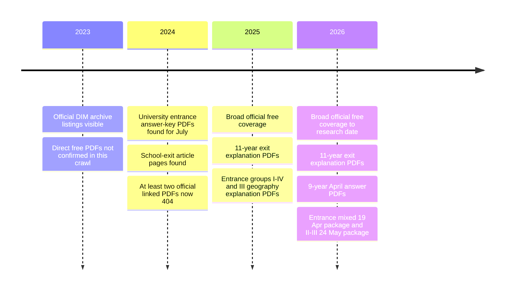

# Azerbaijani State Exam Paper Archive Research

## Executive summary

The strongest **current public official archive** for Azerbaijani state exam papers is the State Examination Center’s website on the `dim.gov.az` domain, principally through the **Bakalavriat** archive for university entrance materials and the **Yekun qiymətləndirmə** archive for school-exit materials. In this crawl, I verified **35 live official PDF files** and **2 official-but-broken PDF links**. The corpus is heavily concentrated in **2025–2026**, noticeably thinner in **2024**, and incomplete for **2023 and earlier** in the open archive that is publicly reachable today. citeturn2search2turn18search2turn18search0turn42view1turn42view2

The pattern is clear. For **2025–2026**, the official site frequently publishes either full **“izah” PDFs** that reproduce the actual used test items with explanations, or **“etalon” PDFs** that provide official answer keys for the closed and codable-open items. For **2024**, I confirmed live official answer-key PDFs for the July university entrance sessions, but school-exit coverage is weaker: some official article pages still exist while at least two linked PDF files now return **404 Not Found**. For **2023**, the official archive still lists exam-material news items, but I did not confirm surviving free direct-download PDFs from the current public crawl. citeturn43view0turn29view0turn29view1turn32view0turn33view0turn18search0turn40view0turn41view0turn42view1turn42view2

On language coverage, the official open archive consistently confirms **Azerbaijani** and **Russian** as the main sector languages. It also shows **other languages as foreign-language subject sections**—most clearly **English** and **German** in the 9-year school-exit answer packs, and **English** and **Russian** inside several 11-year explanation packs. I did **not** confirm additional full parallel exam-sector versions beyond Azerbaijani and Russian in the live official corpus. Some search previews misleadingly label PDFs as **“Ərəb dili,”** but visual inspection of the first pages shows they are general exam packs; that appears to be a metadata artifact rather than an Arabic-language exam version. citeturn34view0turn30view0turn13view6turn13view7turn45view0turn45view2

## Source base and verification

The two official archive hubs that produced nearly all primary-source results in this research are:

`https://dim.gov.az/az/fealiyyet/qebul-ve-imtahanlar/bakalavriat`  
`https://dim.gov.az/az/fealiyyet/qebul-ve-imtahanlar/yekun-qiymetlendirme`  citeturn2search2turn18search2

I treated a file as **official/primary** only when it was hosted on `dim.gov.az` itself or linked directly from an official DIM article page. I then checked the linked PDF or the article text to verify what the document actually was: a full explanation pack, an answer-key pack, or—more rarely—a mixed package covering supplemental or makeup exams. I also visually checked representative first pages to confirm that the files were genuine exam-material PDFs rather than generic announcements. Representative checks included the **15 March 2026 11-year exit explanation PDF**, the **5 April 2026 9-year answer-etalon PDF**, and the **13 July 2025 Group I entrance explanation PDF**. citeturn45view0turn45view1turn45view2

A practical caution: older DIM article pages sometimes still contain a “buradan” download link, but the linked file has disappeared from the server. That happened in this crawl for at least the **7 April 2024** and **21 April 2024** 9-year school-exit answer-etalon pages. Those page URLs are official and still live, but the underlying PDF links are now broken. citeturn40view0turn41view0turn42view1turn42view2

## Archive availability by year

The official archive becomes much more useful from **2025 onward**. In 2025 and 2026, DIM routinely posted question-containing explanation PDFs for many major sessions, especially **11-year school-exit exams** and **main university entrance groups**. In 2024, however, DIM’s easily retrievable public footprint is more answer-key-centric and more fragile. The 2023 archive still lists exam-material posts, but free live direct PDFs were not verified in this crawl. citeturn18search0turn28search6turn24search8turn40view0turn41view0

One additional 2026 gap is notable: DIM’s result portal explicitly references a **17 May 2026** school-exit exam date, but I did not locate a corresponding public question/answer PDF link in the archive pages I verified for this report. citeturn24search11turn28search6

## Master file ledger

The table below lists every exact file URL I found or validated during this crawl. “Notes” indicates whether the file is a full question-containing explanation pack, an answer-only etalon, a mixed package, or a broken official link.

| Year | Exam Type | Subject | Group | Language | File Name | Direct URL | Format | Source Type | Notes |
|---|---|---|---|---|---|---|---|---|---|
| 2026 | University entrance | Composite explanation | II | Azerbaijani sector | `2_qrup-az_1779613190.pdf` | `https://dim.gov.az/CkImage/2_qrup-az_1779613190.pdf` | PDF | official | Live official explanation PDF for 24 May 2026; A–D variants. citeturn10view0turn12view0 |
| 2026 | University entrance | Composite explanation | III | Azerbaijani + Russian sectors | `3_qrup_az_1779613253.pdf` | `https://dim.gov.az/CkImage/3_qrup_az_1779613253.pdf` | PDF | official | Live official explanation PDF for 24 May 2026; Russian-sector pages are visible inside the same file. citeturn10view0turn12view1turn13view2 |
| 2026 | University entrance | Answer key etalon | II–III | Azerbaijani + Russian | `ETA_II_III_qrup_26_I_1779613446.pdf` | `https://dim.gov.az/CkImage/ETA_II_III_qrup_26_I_1779613446.pdf` | PDF | official | Official answer pack for 24 May 2026; answers only, not a full booklet. citeturn10view0turn12view2turn16view1 |
| 2026 | University entrance / mixed | Composite explanation | V + mixed supplemental exams | English + Azerbaijani + Russian content | `İzahlar kompleks_19-04_26 (1)_1776666856.pdf` | `https://dim.gov.az/CkImage/%C4%B0zahlar%20kompleks_19-04_26%20%281%29_1776666856.pdf` | PDF | official | Mixed official package for 19 Apr 2026 covering entrance/exit-related supplemental sessions rather than one standard group paper. citeturn23view0turn24search0turn25view0 |
| 2026 | University entrance / mixed | Answer key etalon | V + mixed supplemental exams | Mixed | `19_aprel_buraxilish_X_1776592952.pdf` | `https://dim.gov.az/CkImage/19_aprel_buraxilish_X_1776592952.pdf` | PDF | official | Official answer pack for the 19 Apr 2026 mixed package. citeturn23view0turn25view1 |
| 2025 | University entrance | Composite explanation | I | Azerbaijani sector | `1_ci_qrup_1752476895.pdf` | `https://dim.gov.az/CkImage/1_ci_qrup_1752476895.pdf` | PDF | official | Live official explanation PDF for 13 Jul 2025; A–D variants. citeturn43view0turn44view0turn45view2 |
| 2025 | University entrance | Composite explanation | IV | Azerbaijani sector | `4_cu_qrup_1752476942.pdf` | `https://dim.gov.az/CkImage/4_cu_qrup_1752476942.pdf` | PDF | official | Live official explanation PDF for 13 Jul 2025; A–D variants. citeturn43view0turn44view1 |
| 2025 | University entrance | Geography explanation | III geography add-on | Azerbaijani | `Untitled attachment 00020_1752476961.pdf` | `https://dim.gov.az/CkImage/Untitled%20attachment%2000020_1752476961.pdf` | PDF | official | Official geography explanation file linked from the 13 Jul 2025 materials page. citeturn43view0turn44view2 |
| 2025 | University entrance | Answer key etalon | I–IV + III geography | Mixed sectors | `Eta_2025_14_2_x_1752398449_1752477059.pdf` | `https://dim.gov.az/CkImage/Eta_2025_14_2_x_1752398449_1752477059.pdf` | PDF | official | Official answer pack for the 13 Jul 2025 materials page. citeturn43view0turn44view3 |
| 2025 | University entrance | Composite explanation | II | Azerbaijani sector | `2_qrup-az_1751887338.pdf` | `https://dim.gov.az/CkImage/2_qrup-az_1751887338.pdf` | PDF | official | Live official explanation PDF for 6 Jul 2025; A–D variants. citeturn10view3turn12view10 |
| 2025 | University entrance | Composite explanation | III | Azerbaijani-sector filename | `3_qrup_az_1751887363.pdf` | `https://dim.gov.az/CkImage/3_qrup_az_1751887363.pdf` | PDF | official | Live official explanation PDF for 6 Jul 2025; the page is official, but I did not separately confirm Russian pages inside this specific explanation file during the crawl. citeturn10view3turn12view11 |
| 2025 | University entrance | Answer key etalon | II–III | Azerbaijani + Russian | `2_3 qrup_2025_2_X_1751793180_1751887430.pdf` | `https://dim.gov.az/CkImage/2_3%20qrup_2025_2_X_1751793180_1751887430.pdf` | PDF | official | Official answer pack for 6 Jul 2025; Russian-sector pages are visible for Group III. citeturn10view3turn12view12turn16view7turn16view8 |
| 2025 | University entrance | Composite explanation | I | Azerbaijani sector | `1_ci_qrup_1_iyun_2025_izah_1748848147.pdf` | `https://dim.gov.az/CkImage/1_ci_qrup_1_iyun_2025_izah_1748848147.pdf` | PDF | official | Live official explanation PDF for 1 Jun 2025; A–D variants. citeturn10view1turn12view3 |
| 2025 | University entrance | Composite explanation | IV | Azerbaijani sector | `4_cu_qrup_1748848173.pdf` | `https://dim.gov.az/CkImage/4_cu_qrup_1748848173.pdf` | PDF | official | Live official explanation PDF for 1 Jun 2025; A–D variants. citeturn10view1turn12view4 |
| 2025 | University entrance | Geography explanation | III geography add-on | Azerbaijani | `cografiya_izah_1748848194.pdf` | `https://dim.gov.az/CkImage/cografiya_izah_1748848194.pdf` | PDF | official | Official geography explanation file linked from the 1 Jun 2025 page. citeturn10view1turn12view5 |
| 2025 | University entrance | Answer key etalon | I–IV + III geography | Azerbaijani | `1_4_coq_eta_1 iyun__1748769750.pdf` | `https://dim.gov.az/CkImage/1_4_coq_eta_1%20iyun__1748769750.pdf` | PDF | official | Official answer pack for the 1 Jun 2025 materials page. citeturn10view1turn12view6 |
| 2025 | University entrance | Composite explanation | II | Azerbaijani sector | `2-ci_qrup_s_1748871668.pdf` | `https://dim.gov.az/CkImage/2-ci_qrup_s_1748871668.pdf` | PDF | official | Live official explanation PDF for 25 May 2025. citeturn10view2turn12view7 |
| 2025 | University entrance | Composite explanation | III | Azerbaijani + Russian sectors | `3-cu_qrup_1748239606.pdf` | `https://dim.gov.az/CkImage/3-cu_qrup_1748239606.pdf` | PDF | official | Live official explanation PDF for 25 May 2025; Russian-sector content is present inside the file. citeturn10view2turn12view8turn13view5 |
| 2025 | University entrance | Answer key etalon | II–III | Azerbaijani + Russian | `3_2_1_x_1748239634.pdf` | `https://dim.gov.az/CkImage/3_2_1_x_1748239634.pdf` | PDF | official | Official answer pack for 25 May 2025; Russian-sector pages appear in the Group III section. citeturn10view2turn12view9turn16view4turn16view5 |
| 2024 | University entrance | Answer key etalon | II–III | Azerbaijani + Russian | `eta_umumi_1720344950.pdf` | `https://dim.gov.az/CkImage/eta_umumi_1720344950.pdf` | PDF | official | Official July 2024 answer pack indexed by search; Group III Russian sector is visible in the snippet. I did not locate a matching official free explanation PDF. citeturn21search1turn22search3 |
| 2024 | University entrance | Answer key etalon | I–IV + III geography | Azerbaijani sector visible | `2024_14_COGR_2_int_1720948664.pdf` | `https://dim.gov.az/CkImage/2024_14_COGR_2_int_1720948664.pdf` | PDF | official | Official 14 Jul 2024 answer pack indexed by search; at least Azerbaijani-sector pages are visible in the snippet. I did not locate a matching official free explanation PDF. citeturn21search3 |
| 2026 | School exit | Composite explanation | — | Composite pack; English subject section visible | `Attestat_all_09.03.2026_1773051095.pdf` | `https://dim.gov.az/CkImage/Attestat_all_09.03.2026_1773051095.pdf` | PDF | official | Live official 11-year exit explanation PDF for 9 Mar 2026; question-containing explanation pack. citeturn29view1turn30view2 |
| 2026 | School exit | Answer key etalon | — | Mixed panels | `2026_11_1__1773051441.pdf` | `https://dim.gov.az/CkImage/2026_11_1__1773051441.pdf` | PDF | official | Official 11-year answer pack for 9 Mar 2026; answers only. citeturn29view1turn30view3 |
| 2026 | School exit | Composite explanation | — | Composite pack; English subject section visible | `Attestat_all_15.03.2026_1773569675.pdf` | `https://dim.gov.az/CkImage/Attestat_all_15.03.2026_1773569675.pdf` | PDF | official | Live official 11-year exit explanation PDF for 15 Mar 2026; visually confirmed as a question-containing pack. citeturn29view0turn30view0turn45view0 |
| 2026 | School exit | Answer key etalon | — | Mixed panels | `15 mart_buraxilis_etalon_1773569752.pdf` | `https://dim.gov.az/CkImage/15%20mart_buraxilis_etalon_1773569752.pdf` | PDF | official | Official 11-year answer pack for 15 Mar 2026; answers only. citeturn29view0turn30view1 |
| 2026 | School exit | Answer key etalon | — | Azerbaijani + Russian sectors; English/Russian/German foreign-language panels | `9_illik_05.04.26__1775461900.pdf` | `https://dim.gov.az/CkImage/9_illik_05.04.26__1775461900.pdf` | PDF | official | Official 9-year answer pack for 5 Apr 2026; visually confirmed and includes multiple language panels. citeturn33view0turn34view0turn45view1 |
| 2026 | School exit | Answer key etalon | — | Sector split not fully parsed from the crawl | `9 illik 12.04.26__1776068705.pdf` | `https://dim.gov.az/CkImage/9%20illik%2012.04.26__1776068705.pdf` | PDF | official | Official 9-year answer pack for 12 Apr 2026; live file confirmed. citeturn29view2turn30view4 |
| 2026 | School exit | Answer key etalon | — | Azerbaijani sector visible; broader pack likely | `9__eta_3 -_1777286416.pdf` | `https://dim.gov.az/CkImage/9__eta_3%20-_1777286416.pdf` | PDF | official | Official 9-year answer pack for 26 Apr 2026; live file confirmed. citeturn32view0turn33view1 |
| 2025 | School exit | Composite explanation | — | Composite pack with Azerbaijani commentary and multiple subject-language sections | `buraxilish_2_03_25_1740979917.pdf` | `https://dim.gov.az/CkImage/buraxilish_2_03_25_1740979917.pdf` | PDF | official | Live official 11-year exit explanation PDF for 2 Mar 2025. citeturn10view7turn12view15turn22search4 |
| 2025 | School exit | Answer key etalon | — | Mixed panels | `eta_11_1__1740979950.pdf` | `https://dim.gov.az/CkImage/eta_11_1__1740979950.pdf` | PDF | official | Official 11-year answer pack for 2 Mar 2025; answers only. citeturn10view7turn12view16 |
| 2025 | School exit | Composite explanation | — | Azerbaijani + Russian content confirmed | `izah_1741582198.pdf` | `https://dim.gov.az/CkImage/izah_1741582198.pdf` | PDF | official | Live official 11-year exit explanation PDF for 9 Mar 2025; Russian-language section confirmed inside the file. citeturn10view6turn12view13turn13view6 |
| 2025 | School exit | Answer key etalon | — | Mixed panels | `etalon-9_mart_1741582229.pdf` | `https://dim.gov.az/CkImage/etalon-9_mart_1741582229.pdf` | PDF | official | Official 11-year answer pack for 9 Mar 2025; answers only. citeturn10view6turn12view14turn37search3 |
| 2025 | School exit | Answer key etalon | — | Azerbaijani + Russian sectors; foreign-language panels | `9_illik_1_eta__1744619536.pdf` | `https://dim.gov.az/CkImage/9_illik_1_eta__1744619536.pdf` | PDF | official | Official 9-year answer pack for 13 Apr 2025. citeturn37search2 |
| 2025 | School exit | Answer key etalon | — | Azerbaijani + Russian sectors; foreign-language panels | `etalon_20_1745221880.pdf` | `https://dim.gov.az/CkImage/etalon_20_1745221880.pdf` | PDF | official | Official 9-year answer pack for 20 Apr 2025. citeturn37search0 |
| 2025 | School exit | Answer key etalon | — | Azerbaijani + Russian sectors; foreign-language panels | `9_4_etalon_1745820785.pdf` | `https://dim.gov.az/CkImage/9_4_etalon_1745820785.pdf` | PDF | official | Official 9-year answer pack for 27 Apr 2025. citeturn37search4 |
| 2024 | School exit | Answer key etalon | — | Unknown | `ba451f225d1ad9f45390c18684ebf6bf.pdf` | `https://dim.gov.az/upload/iblock/ba4/ba451f225d1ad9f45390c18684ebf6bf.pdf` | PDF | official | Official file linked from the 7 Apr 2024 answer-etalon page, but the current file URL returns 404. citeturn40view0turn42view1 |
| 2024 | School exit | Answer key etalon | — | Unknown | `85d5a146cb5d077d598fec7f06df4094.pdf` | `https://dim.gov.az/upload/iblock/85d/85d5a146cb5d077d598fec7f06df4094.pdf` | PDF | official | Official file linked from the 21 Apr 2024 answer-etalon page, but the current file URL returns 404. citeturn41view0turn42view2 |

## Gaps and authenticity assessment

The most important gap is **pre-2025 official completeness**. I was able to verify live official 2024 university entrance answer-key PDFs and live official 2024 article pages for school-exit materials, but I did **not** confirm free official direct-download explanation PDFs for the **3 March 2024** and **10 March 2024** 11-year exit sessions in the current crawl. I also found a live official article page for the **17 March 2024** 9-year answer-etalon release, but I did not resolve a surviving direct file URL before completing this report. citeturn41view1turn41view2turn42view0

A second gap is **2023 and older TQDK-era open access**. The official Bakalavriat archive still lists 2023 exam-material posts—such as the July 2023 II/III materials and June 2023 I/IV materials—but I did not verify surviving free, directly downloadable public PDFs from those listings during this crawl. That means older official materials may still exist behind changing storage paths, in special issues, or in e-service channels, but they were **not confirmable as stable direct-download URLs** here. citeturn18search0

A third gap is **exact facsimile booklet availability**. Many 2025–2026 official files are **explanation PDFs** rather than image-perfect scans of the original booklet layout. They are still highly valuable because they reproduce the used items, the mapped variant numbers, and the official answers; however, they are not always the same thing as the original printed “sual kitabçası.” For 9-year materials especially, the public official release is often only the **etalon answer PDF** rather than a full question booklet. citeturn30view0turn34view0turn45view0turn45view1

Because of those gaps, I did **not** populate this ledger with low-confidence third-party reposts from social media or educational aggregators unless the underlying file itself was on the official `dim.gov.az` domain. That keeps the table conservative and authenticity-first.

## Recommended next steps

The fastest way to improve coverage is to target the **broken 2024 official URLs** first. Because the official article pages still exist and expose the dead download paths, those exact file URLs should be checked against web archives and mirror indexes. The two broken URLs already identified in this report are good starting points. citeturn40view0turn41view0turn42view1turn42view2

For **2023 and earlier**, the most promising official route is DIM’s own historical archive ecosystem rather than broad web search: start from the Bakalavriat and Yekun archive pages, then follow any special-issue or “Abituriyent” references. DIM’s archive explicitly notes special issues for school-exit materials, which suggests that some older papers may survive in journal/special-bulletin form even when article-level file links are missing. citeturn18search0turn36view0

If you need the missing files for serious archival work, the most direct administrative step is to contact **DIM** and cite the exact article pages and the dead file URLs. The official pages display DIM’s public contact email and short code. citeturn23view0turn29view0

If the goal is not merely “official enough” but specifically **exact original booklet facsimiles**, I would prioritize a second pass focused on three targets: older **Abituriyent special issues**, **archived DIM/TQDK storage paths**, and official **DIM social posts** around publication dates that may still point to image files or alternate storage locations. Based on this crawl, that is the most likely path to closing the remaining 2023–2024 gaps.